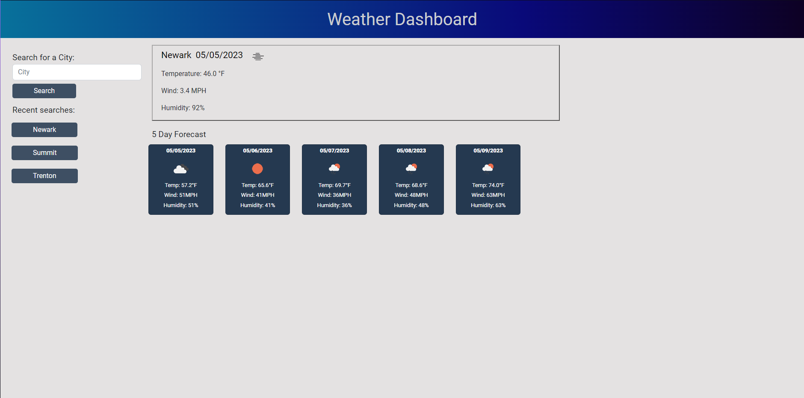
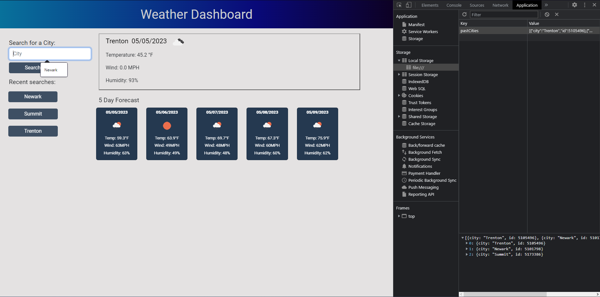

# Weather Dashboard Challenge

## Description

This application uses OpenWeather Api to create a weather dashboard using JS, CSS, HTML, and JQuery. Through the application users can view the current weather of the city of their choosing as well as the five day forecast for that city. Users can also view past cities that are stored using local storage.

## Installation

N/A

## Usage

HTML, CSS, Bootstraps, OpenWeather Api, JavaScript, and JQuery

## Demos

Links below provide a functionality of webpage.

## Credits

Rutger University: https://git.bootcampcontent.com/Rutgers-University/RUT-VIRT-FSF-FT-02-2023-U-LOLC

### References:
- [Instuctor Videos: JD Tadlock](https://gist.github.com/jdtdesigns/9cfe05400063902e46aa5f6faabff0ca)
- [OpenWeather Current Weather Documentation](https://openweathermap.org/current)
- [OpenWeather One Call Documentation](https://openweathermap.org/api/one-call-3)
- [Bootstraps Documentation](https://getbootstrap.com/docs/4.0/getting-started/introduction/)

## License

MIT License

Copyright (c) [2023] [Matos,Natalie]

Permission is hereby granted, free of charge, to any person obtaining a copy
of this software and associated documentation files (the "Software"), to deal
in the Software without restriction, including without limitation the rights
to use, copy, modify, merge, publish, distribute, sublicense, and/or sell
copies of the Software, and to permit persons to whom the Software is
furnished to do so, subject to the following conditions:

The above copyright notice and this permission notice shall be included in all
copies or substantial portions of the Software.

THE SOFTWARE IS PROVIDED "AS IS", WITHOUT WARRANTY OF ANY KIND, EXPRESS OR
IMPLIED, INCLUDING BUT NOT LIMITED TO THE WARRANTIES OF MERCHANTABILITY,
FITNESS FOR A PARTICULAR PURPOSE AND NONINFRINGEMENT. IN NO EVENT SHALL THE
AUTHORS OR COPYRIGHT HOLDERS BE LIABLE FOR ANY CLAIM, DAMAGES OR OTHER
LIABILITY, WHETHER IN AN ACTION OF CONTRACT, TORT OR OTHERWISE, ARISING FROM,
OUT OF OR IN CONNECTION WITH THE SOFTWARE OR THE USE OR OTHER DEALINGS IN THE
SOFTWARE.